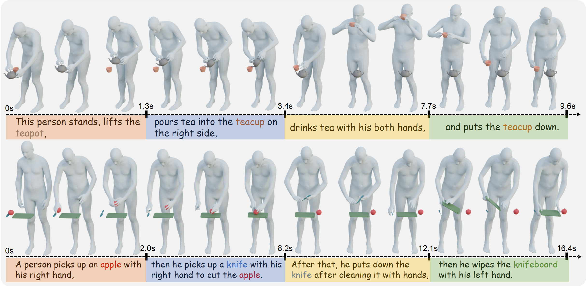

# HIMO: A New Benchmark for Full-Body Human Interacting with Multiple Objects



<p align="left">
  <a href=''>
    
  </a>
  <a href=''>
    
  </a>
  <a href='https://lvxintao.github.io/himo'>
  </a>
  <a href="" target='_blank'>
    
  </a>
</p>

This repository contains the content of the following paper:
> HIMO: A New Benchmark for Full-Body Human Interacting with Multiple Objects <br> Xintao Lv <sup>1,* </sup>, Liang Xu <sup>1,2* </sup>, Yichao Yan <sup>1</sup>, Xin Jin <sup>2</sup>, Congsheng Xu <sup>1</sup>, Shuwen Wu<sup>1</sup>, Yifan Liu<sup>1</sup>, Lincheng Li<sup>3</sup>, Mengxiao Bi<sup>3</sup>, Wenjun Zeng<sup>2</sup>, Xiaokang Yang <sup>1</sup> <br>
> <sup>1</sup> Shanghai Jiao Tong University , <sup>2</sup> Eastern Institute of Technology, Ningbo, <sup>3</sup> NetEase Fuxi AI Lab


## Dataset Download
Please fill out [this form](https://docs.google.com/forms/d/e/1FAIpQLSdl5adeyKxBSBFZpgs0A7-dAouRkMFAGUP5iz3zxGDj_PhB1w/viewform) to request authorization to download HIMO for research purposes.
After downloading the dataset, unzip the data in `./data` and you'll get the following structure:
```shell
./data
|-- joints
|   |-- S01T001.npy
|   |-- ...
|-- smplx
|   |-- S01T001.npz
|   |-- ...
|-- object_pose
|   |-- S01T001.npy
|   |-- ...
|-- text
|   |-- S01T001.txt
|   |-- ...
|-- segments
|   |-- S01T001.json
|   |-- ...
|-- object_mesh
|   |-- Apple.obj
|   |-- ...

```

## Data Visualization
We use the [AIT-Viewer](https://github.com/eth-ait/aitviewer) to visualize the dataset. You can follow the instructions below to visualize it.
```bash
pip install -r visualize/requirements.txt
```
You also need to download the [SMPL-X models](https://smpl-x.is.tue.mpg.de/) and place them in `./body_models`, which should look like:
```shell
./body_models
|-- smplx
    ├── SMPLX_FEMALE.npz
    ├── SMPLX_FEMALE.pkl
    ├── SMPLX_MALE.npz
    ├── SMPLX_MALE.pkl
    ├── SMPLX_NEUTRAL.npz
    ├── SMPLX_NEUTRAL.pkl
    └── SMPLX_NEUTRAL_2020.npz
```
Then you can run the following command to visualize the dataset.
```bash
# Visualize the skeleton
python visualize/skel_viewer.py
# Visualize the SMPLX
python visualize/smplx_viewer.py
# Visualize the segment data
python visualize/segment_viewer.py
```

## Training 
To train the model in 2-object setting, run
```bash
python -m src.train.train_net_2o --exp_name net_2o --num_epochs 1000
```
To train the model in 3-object setting, run
```bash
python -m src.train.train_net_3o --exp_name net_3o --num_epochs 1000
```
To evaluate the model, you need to train your own evaluator or use the checkpoint we provide [here](https://drive.google.com/drive/folders/11PYdla0R9GIyYXqDPMle9208Hv8MaUMo?usp=sharing) (put them under `./save`).
Then run
```bash
python -m src.eval.eval_himo_2o
```
or
```bash
python -m src.eval.eval_himo_3o
```

## Visualization
